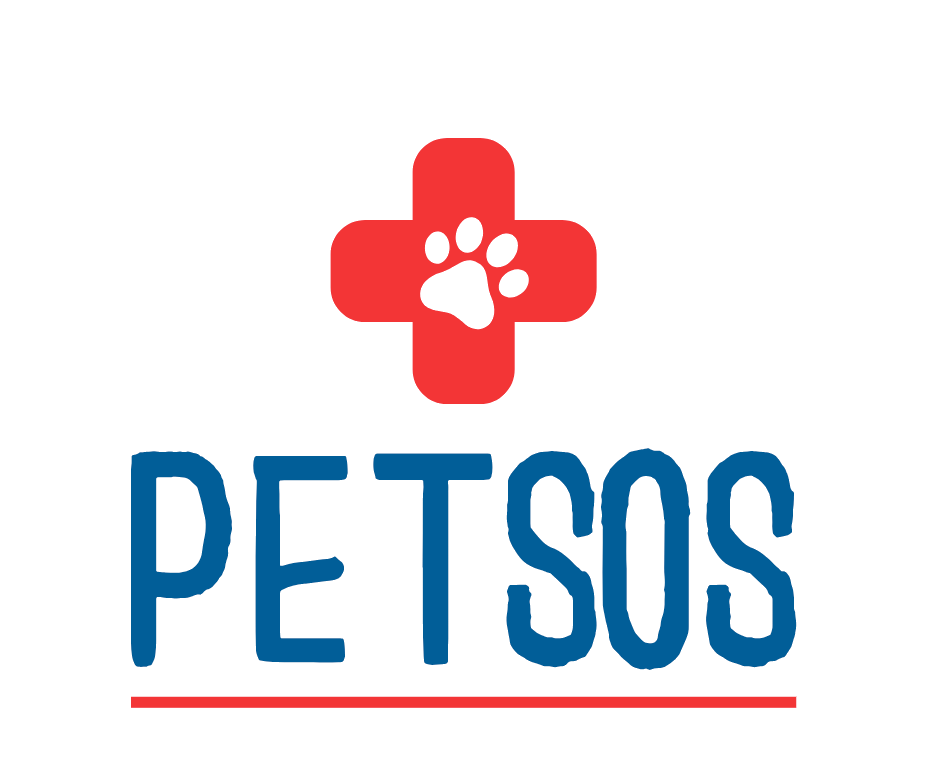

<a id="readme-top"></a>
<div align="center">
  <a href="https://github.com/winnier21/chelsea-hsieh-capstone">
    
  </a>

  <h3 align="center">PetSOS</h3>

  <p align="center">
    A mobile application to assist pet owners in managing emergency situations efficiently.
    <br />
    <a href="https://github.com/winnier21/chelsea-hsieh-capstone"><strong>Explore the docs »</strong></a>
    <br />
    <br />
    <a href="https://github.com/winnier21/chelsea-hsieh-capstone">View Demo</a>
    ·
    <a href="https://github.com/winnier21/chelsea-hsieh-capstone/issues/new?labels=bug&template=bug-report---.md">Report Bug</a>
    ·
    <a href="https://github.com/winnier21/chelsea-hsieh-capstone/issues/new?labels=enhancement&template=feature-request---.md">Request Feature</a>
  </p>
</div>

<details>
  <summary>Table of Contents</summary>
  <ol>
    <li>
      <a href="#about-the-project">About The Project</a>
      <ul>
        <li><a href="#built-with">Built With</a></li>
      </ul>
    </li>
    <li>
      <a href="#getting-started">Getting Started</a>
      <ul>
        <li><a href="#prerequisites">Prerequisites</a></li>
        <li><a href="#installation">Installation</a></li>
      </ul>
    </li>
    <li><a href="#usage">Usage</a></li>
    <li><a href="#roadmap">Roadmap</a></li>
    <li><a href="#contributing">Contributing</a></li>
    <li><a href="#license">License</a></li>
    <li><a href="#contact">Contact</a></li>
    <li><a href="#acknowledgments">Acknowledgments</a></li>
  </ol>
</details>

## About The Project

PetSOS is a mobile application designed to assist pet owners in managing emergency situations efficiently by providing immediate access to local veterinary services, step-by-step first aid instructions, and navigation to the nearest vet that can offer immediate assistance. It also includes an intelligent chat feature that helps pet owners describe their emergencies and receive instant advice.

### Problem

Pet owners deeply care for their pets, yet many lack the necessary knowledge and preparation for handling pet emergencies effectively. Statistics reveal that most North American pet owners are unprepared to provide essential emergency care during life-threatening situations. PetSOS addresses this issue by providing critical guidance in emergencies.

### User Profile

Pet owners who need immediate and reliable emergency responses for their pets. Users may be in remote areas with limited access to veterinary services or may need guidance on handling emergencies before professional help is available.

### Features

PetSOS aims to bridge the knowledge gap that exists in pet emergency first aid. This app accomplishes four main things:

1. Automatically prepares a list of nearby veterinarians and calls each until answered.
2. Guides pet owners with accurate first aid instructions and procedures while waiting for veterinarian response.
3. Navigates the user to the nearest open veterinary clinic or the clinic they would like to go based on opening hours information, ensuring they go to a clinic that can see them immediately by utilizing the Places API.
4. Interactive Chat Feature: Utilizes the ChatGPT API to let users describe their pet's emergency in natural language and receive immediate, contextually relevant advice.

<p align="right">(<a href="#readme-top">back to top</a>)</p>

### Built With

* [![React Native][React.js]][React-url]
* [![Node.js][Node.js]][Node-url]
* [![Express.js][Express.js]][Express-url]
* [![Google Places API][GooglePlaces]][GooglePlaces-url]
* [![OpenAI][OpenAI]][OpenAI-url]

<p align="right">(<a href="#readme-top">back to top</a>)</p>

## Getting Started

To get a local copy up and running follow these simple steps.

### Prerequisites
* npm
  ```sh
  npm install npm@latest -g
  ```
### Installation

1. Get a free Places API Key at [https://console.cloud.google.com/apigee/welcome](https://console.cloud.google.com/apigee/welcome)

2. Get a OpenAI API key ($US 5 required) at [https://platform.openai.com/api-keys](https://platform.openai.com/api-keys)

2. Clone the repo
   ```sh
   git clone https://github.com/winnier21/PetSOS
   ```
3. Install NPM packages
   ```sh
   npm install cors dotenv express node-fetch nodemon openai 
   ```
4. Enter your API in `.env.example` files in both client and server directories and renames the file name of.env.example to .env


<p align="right">(<a href="#readme-top">back to top</a>)</p>

# Server .env
- PORT=8080
- BACKEND_URL=http://localhost
- OPENAI_API_KEY=Put you your OpenAI_API here
- GOOGLE_API_KEY=Put in your Places_API here 

# Client .env
- VITE_OPENAI_API_KEY=Put you your OpenAI_API here
- VITE_GOOGLE_API_KEY=Put in your Places_API here
- VITE_API_URL=(http://localhost:8080)
<p align="right">(<a href="#readme-top">back to top</a>)</p>

## Usage
Use the PetSOS app to manage pet emergencies efficiently. The app allows you to:

Automatically call the nearest veterinary clinic.
Get real-time navigation to the nearest open clinic.

Receive step-by-step first aid instructions.
Chat with an intelligent assistant for immediate advice.

Start the Server in terminal:
```sh
cd server
npm run dev
```

Start the Client in terminal:
```sh
cd client
npm run dev
```
Start the browser (app): 
```sh
- click "http://localhost:5173" 
- Remember to allow navigation your current location when the request pops out
```

<p align="right">(<a href="#readme-top">back to top</a>)</p>

## Prototypes

### Home Page 

1. **Emergency Call Button**: Swipe right on the SOS button to initiate a call to the nearest veterinary clinic based on your current location. If the call fails, the app will automatically call the next closest clinic.

2. **ChatGPT Assistance**: Type in any pet emergency query and receive instant responses from ChatGPT.


### Navigation page 

1. **Real-Time Navigation**: Use the navigation button to get real-time directions from your current location.


2. **Search Bar and Clinic Information**: Utilize the search bar with drop-down options to find clinics. After selecting a clinic, view its opening hours for better planning.


3. **Directions to Clinic**: Get directions to the clinic. Clicking "More Options" will open the route in Google Maps for further navigation.


## Roadmap
1. Initial Setup and Basic Layout
2. API Integration and UI Development
3. Chat Interface and ChatGPT Integration
4. Self-Testing and Refinement
5. Final Adjustments and Comprehensive Testing
6. Preparation for Presentation

<p align="right">(<a href="#readme-top">back to top</a>)</p>


## Contact
Chelsea Hsieh - [LinkedIn](https://www.linkedin.com/in/chelsea-hsieh/) - winnier16@gmail.com

Project Link: [https://github.com/winnier21/chelsea-hsieh-capstone](https://github.com/winnier21/chelsea-hsieh-capstone)

<p align="right">(<a href="#readme-top">back to top</a>)</p>


<!-- MARKDOWN LINKS & IMAGES -->
<!-- https://www.markdownguide.org/basic-syntax/#reference-style-links -->
[React.js]: https://img.shields.io/badge/React_Native-20232A?style=for-the-badge&logo=react&logoColor=61DAFB
[React-url]: https://reactnative.dev/
[Node.js]: https://img.shields.io/badge/Node.js-43853D?style=for-the-badge&logo=node.js&logoColor=white
[Node-url]: https://nodejs.org/en
[Express.js]: https://img.shields.io/badge/Express.js-000000?style=for-the-badge&logo=express&logoColor=white
[Express-url]: https://expressjs.com/
[GooglePlaces]: https://img.shields.io/badge/Google_Places_API-4285F4?style=for-the-badge&logo=google-maps&logoColor=white
[GooglePlaces-url]: https://developers.google.com/maps/documentation/places/web-service/overview
[OpenAI]: https://img.shields.io/badge/OpenAI-412991?style=for-the-badge&logo=openai&logoColor=white
[OpenAI-url]: https://openai.com/


